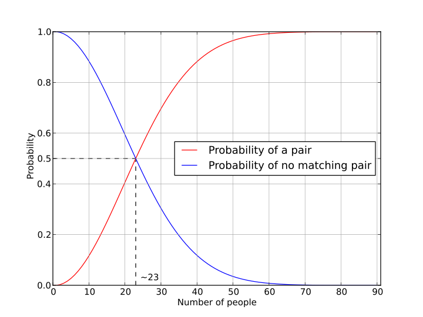

# Pràctica 3: Simulació de la Paradoxa dels Aniversaris  

En aquesta pràctica, desenvolupareu un programa en Python per simular i analitzar la **paradoxa dels aniversaris**. Aquesta paradoxa estableix que en un grup relativament petit de persones, hi ha una probabilitat sorprenentment alta que almenys dues persones comparteixin el mateix aniversari.  

Mitjançant simulacions aleatòries, explorareu com aquesta probabilitat canvia a mesura que augmenta la mida del grup.  

## Objectius  

- Simular grups de persones assignant-los dates de naixement aleatòries.  
- Comptar quantes vegades, en un grup, almenys dues persones tenen el mateix aniversari.  
- Repetir aquest experiment per diferents mides de grup (de 2 a 100 persones).  
- Estimar la probabilitat d’una coincidència d’aniversari per a cada mida de grup mitjançant 1000 simulacions.  
- Representar els resultats amb un gràfic adequat.  

## Teoria Prèvia  

La **paradoxa dels aniversaris** és un problema de probabilitat que mostra que en un grup de només 23 persones, la probabilitat que dues persones comparteixin aniversari supera el **50%**. Això pot semblar contraintuïtiu, però s'explica perquè cada nova persona en un grup té la possibilitat de coincidir amb qualsevol dels anteriors.  

Matemàticament, la probabilitat de **no tenir cap coincidència** en un grup de $n$ persones es pot calcular com:  

$$
P(\text{cap coincidència}) = \frac{365}{365} \times \frac{364}{365} \times \frac{363}{365} \times ... \times \frac{365-n+1}{365}
$$

Aleshores, la probabilitat que **almenys dues persones comparteixin aniversari** és:  

$$
P(\text{coincidència}) = 1 - P(\text{cap coincidència})
$$

Però en lloc de calcular-ho teòricament, farem simulacions per obtenir una estimació empírica.

## Enunciat  

- Generar **1000 grups** per cada mida de grup entre **2 i 100 persones**.  
- Per a cada grup, assignar dates de naixement aleatòries (suposant un any de **365 dies sense anys de traspàs**). Les assignarem com a dia i mes.
- Comprovar si hi ha alguna coincidència d’aniversari dins del grup.  
- Comptar la proporció d'experiments on es dona una coincidència per cada mida de grup.  
- Representar els resultats en un **gràfic** que mostri la probabilitat de coincidència en funció de la mida del grup.  

## Estructura del Projecte  

La pràctica es dividirà en **dos fitxers**:  

### `funcions.py`  

Aquest fitxer contindrà les funcions necessàries per realitzar les simulacions.

### `main.py`  

El fitxer principal del projecte, on:  

- Es defineix el nombre de simulacions (1000).  
- Es recorren mides de grup des de 2 fins a 100 persones.  
- Es criden les funcions de `funcions.py` per calcular les probabilitats experimentals.  
- Es mostren els resultats gràficament.  

## Exemple de Resultat  

### Entrada  

```python
n_simulacions = 1000  # Nombre de simulacions per cada mida de grup
mida_minima_grup = 2 # Grup mínim de 2 persones
mida_maxima_grup = 100  # Grup màxim de 100 persones

# simular_probabilitat
# representar_resultats
```

### Sortida

El gràfic mostrat representarà la probabilitat estimada en funció de la mida del grup, amb una forma similar a aquesta:  


