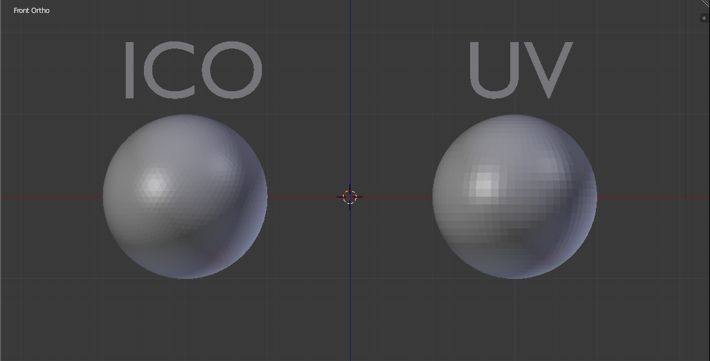

# Pràctica 4: Introducció a Blender i la llibreria bpy

## Què és Blender?

Blender és un programari de modelatge, animació i renderització en 3D de codi obert. És àmpliament utilitzat en la creació de models 3D, animacions, efectes visuals, simulacions físiques i molt més. Ofereix eines avançades per a artistes i desenvolupadors que volen treballar en projectes de gràfics 3D.

## Què és la llibreria `bpy`?

`bpy` és la llibreria de Python integrada en Blender que permet accedir i manipular l'escena 3D mitjançant scripts. Aquesta llibreria permet automatitzar tasques com la creació d'objectes, la modificació de materials, la generació d'animacions i l'exportació d'escenes.

## Com funciona `bpy` en Blender?

Blender incorpora una API (Application Programming Interface) que permet interactuar amb tots els elements d'una escena mitjançant Python. La llibreria `bpy` ofereix diferents mòduls i funcions que permeten treballar amb objectes, materials, càmeres, llums, animacions i altres elements.

### 1. Estructura de `bpy`

La llibreria `bpy` es divideix en diversos mòduls principals:

- **`bpy.ops`**: Conté operadors que permeten executar accions a l'escena, com afegir objectes, eliminar-los o modificar-ne propietats.
- **`bpy.data`**: Permet accedir directament a les dades de Blender, com objectes, materials, llums i càmeres.
- **`bpy.context`**: Fa referència a l'estat actual de Blender i als objectes actius en un moment determinat.
- **`bpy.types`**: Defineix els diferents tipus de dades disponibles dins de Blender, com ara objectes, materials i modificadors.
- **`bpy.utils`**: Conté funcions d'utilitat per a operacions generals amb Python dins de Blender.

### 2. `bpy.ops` – Operadors

Els operadors són funcions que permeten executar accions a l'escena de Blender. Aquests operadors són similars a les accions realitzades manualment per l'usuari dins de la interfície de Blender.

Exemples d’operadors:

- `bpy.ops.mesh.primitive_cube_add()`: Afegeix un cub a l'escena.
- `bpy.ops.object.delete()`: Elimina l'objecte seleccionat.
- `bpy.ops.object.select_all(action='SELECT')`: Selecciona tots els objectes de l'escena.

#### `bpy.ops.mesh` – Creació de primitius 3D

Dins del mòdul `bpy.ops.mesh`, podem trobar operadors per crear diferents objectes geomètrics. Alguns dels més utilitzats són:

- `bpy.ops.mesh.primitive_cube_add()`: Afegeix un cub.
- `bpy.ops.mesh.primitive_ico_sphere_add()`: Afegeix una icoesfera.
- `bpy.ops.mesh.primitive_uv_sphere_add()`: Afegeix una esfera UV.
- `bpy.ops.mesh.primitive_cylinder_add()`: Afegeix un cilindre.
- `bpy.ops.mesh.primitive_cone_add()`: Afegeix un con.
- `bpy.ops.mesh.primitive_torus_add()`: Afegeix un dònut.
- `bpy.ops.mesh.primitive_plane_add()`: Afegeix un pla.

Diferència entre icoesfera i esfera UV:



Cada una d'aquestes funcions té paràmetres opcionals que permeten definir la mida, ubicació i subdivisions.

#### Característiques i modificació d'un objecte primitiu

Quan afegim un objecte primitiu a l'escena, podem modificar-ne diverses propietats amb `bpy`:

- **Ubicació** (`object.location`)
- **Rotació** (`object.rotation_euler` o `object.rotation_quaternion`)
- **Escala** (`object.scale`)
- **Materials** (`object.data.materials`)

Exemples:

```python
obj = bpy.data.objects["Cube"]
obj.location = (1.5, -2, 0)
obj.scale = (2, 2, 2)
obj.rotation_euler = (0, 0, 3.14 / 2)
```

### 3. `bpy.data` – Accés a dades

Aquest mòdul permet accedir a tots els elements de l'escena i modificar-los directament.

- `bpy.data.objects`: Llista de tots els objectes de l’escena.
- `bpy.data.materials`: Accés a tots els materials disponibles.
- `bpy.data.meshes`: Accés a les geometries dels objectes.
- `bpy.data.lights`: Llista de llums disponibles a l'escena.
- `bpy.data.cameras`: Accés a totes les càmeres de l'escena.

Per exemple, per accedir a un objecte anomenat "Cube":

```python
cube = bpy.data.objects["Cube"]
```

Això ens permet modificar les seves propietats sense necessitat d’usar operadors.

### 4. `bpy.context` – Context de Blender

El context fa referència a l’estat actual de Blender. Permet conèixer quin objecte està seleccionat, en quin mode es troba Blender (objecte, edició, escultura, etc.) i altres elements actius.

- `bpy.context.object`: Retorna l'objecte actiu actual.
- `bpy.context.selected_objects`: Retorna una llista d'objectes seleccionats.
- `bpy.context.mode`: Retorna el mode actual de Blender.
- `bpy.context.scene`: Retorna l'escena activa.

Aquest mòdul és essencial per treballar de manera dinàmica amb l’escena.

## Animació amb `bpy`

Un dels aspectes més potents de `bpy` és la capacitat de crear animacions mitjançant fotogrames clau (`keyframes`).

### Què és `keyframe_insert`?

La funció `keyframe_insert(data_path, frame)` permet enregistrar un valor en un fotograma concret per tal que Blender interpol·li el moviment.

- `data_path`: Indica la propietat que volem animar (ex. "location", "rotation_euler").
- `frame`: Indica en quin fotograma es guardarà el valor.

Per exemple, per moure un objecte des de `(0, 0, 0)` fins a `(5, 5, 5)` en 50 fotogrames:

```python
obj = bpy.data.objects["Cube"]
obj.location = (0, 0, 0)
obj.keyframe_insert(data_path="location", frame=1)
obj.location = (5, 5, 5)
obj.keyframe_insert(data_path="location", frame=50)
```

També podem animar la rotació:

```python
obj.rotation_euler = (0, 0, 0)
obj.keyframe_insert(data_path="rotation_euler", frame=1)
obj.rotation_euler = (0, 0, 3.14)
obj.keyframe_insert(data_path="rotation_euler", frame=50)
```

### Gestió dels fotogrames per segon (FPS)

Blender permet ajustar la velocitat d'animació modificant els fotogrames per segon (FPS). Aquest paràmetre es pot trobar a:

```python
bpy.context.scene.render.fps = 24  # Ajustar a 24 fotogrames per segon
```

### Càlcul del nombre de fotogrames necessaris per a representar un moviment

La fórmula per determinar el nombre de fotogrames és:

$$ n = t \cdot FPS $$

Si un moviment ha de durar 2.5 segons en una escena a 30 FPS:

```python
temps = 2.5
fps = bpy.context.scene.render.fps
num_fotogrames = temps * fps  # 75 fotogrames
```

### Aplicació de lleis físiques en animació

Si volem aplicar lleis físiques amb precisió, hem de tenir en compte el factor temps:

#### Exemple de MRU (Moviment Rectilini Uniforme)

Si un objecte es mou a una velocitat constant de 2 unitats per segon en l’eix X, i tenim 24 FPS:

```python
fps = bpy.context.scene.render.fps
velocitat = 2  # unitats per segon
interval = 1 / fps

cube = bpy.context.object
for i in range(0, 5 * fps):  # Moviment durant 5 segons
    cube.location.x += velocitat * interval
    cube.keyframe_insert(data_path="location", frame=i)
```

#### Exemple de MCU (Moviment Circular Uniforme)

Si un objecte segueix una trajectòria circular de radi 3 i velocitat angular de 1 rad/s:

```python
import math
fps = bpy.context.scene.render.fps
radi = 3
omega = 1  # rad/s

esfera = bpy.context.object
for i in range(0, 5 * fps):  # Moviment durant 5 segons
    t = i / fps
    esfera.location.x = radi * math.cos(omega * t)
    esfera.location.y = radi * math.sin(omega * t)
    esfera.keyframe_insert(data_path="location", frame=i)
```

## Part pràctica

Consulta els exercicis per consolidar la teoria vista [aquí](./Part_pràctica.md).
