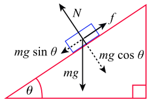

# Pràctica 7: Forces amb Blender i Python

## Fórmules de referència

### Segona llei de Newton

Segons la **segona llei de Newton**:

$$
F_R = m \cdot a
$$

- `F_R`: força neta o resultant(N)
- `m`: massa (kg)
- `a`: acceleració (m/s²)

### Força de fricció

$$
F_{fricció} = \mu \cdot N
$$

- `μ`: coeficient de fricció (unitat sense dimensió)
- `N`: força normal (N)

Aquesta anirà en sentit contràri al moviment i és tangent al pla de contacte entre superfícies.

### Coeficient de fricció estàtica i dinàmica

Es poden calcular dos coeficients de fregament: l'estàtic i el dinàmic.

$$
F_{e} = \mu_e \cdot N
$$

On el coeficient de fregament estàtic μe correspon al de la major força que el cos pot suportar immediatament abans d'iniciar el moviment.

$$
F_{d} = \mu_d \cdot N
$$

On el coeficient de fregament dinàmic μd correspon a la força necessària per mantenir el cos en moviment una vegada iniciat.

### Força neta o resultant

Suma de totes les forces que s'apliquen a un cos. En aquests exercicis, treballarem amb força aplicada al cos (una força externa) i amb la força de fricció, que per tant tindrem:

$$
F_R = F_{aplicada} - F_{fricció}
$$

Alhora que:

$$
F_R = m \cdot a
$$

### Moviment amb acceleració Aplicació a l’animació

Quan la força neta sigui diferent a 0, tindrem acceleració i, per tant, el nostre cos seguirà un MRUA. Recordem: 

$$
v = v_0 + a \cdot t
$$

$$
x = x_0 + v_0 \cdot t + \frac{1}{2} a \cdot t^2
$$

## Exercici 1: Acceleració amb força constant

**Objectiu**:
Simular un cub que es mou en línia recta gràcies a una força constant aplicada.

**Dades**:

- Massa `m = 2 kg`
- Força `F = 10 N`
- Sense fricció
- Durada `20 s`

## Exercici 2: Força aplicada i fricció en superfície horitzontal

**Objectiu**:
Simular un objecte que pateix una força aplicada, però també una força de fricció.

**Dades**:

- Massa `m = 2 kg`
- Gravetat `g = 9.81 m/s²`
- Força aplicada `F = 10 N`
- Coeficient de fricció `μ = 0.2`
- Durada `20 s`

## Exercici 3: Força aplicada insuficient per la superar la fricció

**Objectiu**:
Analitzar què passa quan la força aplicada no és suficient per iniciar el moviment. Comença amb la força aplicada que t'indica les dades i ves-la augmentant fins que aparegui moviment. Pensa en crear les condicions pertintents (blocs de `if-else`) perquè l'objecte es mogui o no. Un cop s'apliqui una força per la qual comença el moviment, utilitzar el coeficient de fricció dinàmica.

**Dades**:

- Massa `m = 2 kg`
- Gravetat `g = 9.81 m/s²`
- Força aplicada `F = 1 N` (anar-la modificant)
- Coeficient de fricció estàtica `μe = 0.5`
- Coeficient de fricció dinàmica `μd = 0.2`
- Durada `20 s`

## Exercici 4: Canvi de superfície

**Objectiu**:
Simular el moviment d’un objecte que segueix un MRU que a partir de `x = 5 m` canvia de superfície i aquesta té fricció. A quina distància s'atura el cos?

**Dades**:

- Massa `m = 2 kg`
- Velocitat inicial `v0 = 10 m/s`
- Gravetat `g = 9.81 m/s²`
- Coeficient de fricció `μ = 0.4`

## Exercici 5: Pla inclinat sense fricció

**Objectiu**:
Simular el moviment d’un objecte per un pla inclinat, sense tenir en compte la fricció, però sí la component el pes. Un cop acaba el pla inclinat, continua amb el moviment corresponent (MRU o MRUA, considereu vosaltres quin).

**Dades**:

- Massa `m = 2 kg`
- Velocitat inicial `v0 = 0 m/s`
- Gravetat `g = 9.81 m/s²`
- Angle pla inclinat `θ = 25°`
- El cos comença a una distància de 3m del terra

**Important**:

Cal considerar quina serà la força resultant del cos i, a partir d'aquesta, calcular l'acceleració que afecta al moviment horitzontal i al moviment vertical.

## Exercici 6: Pla inclinat amb fricció

**Objectiu**:
Simular el moviment d’un objecte per un pla inclinat, tenint en compte la fricció i el pes. Un cop acaba el pla inclinat, continua amb el moviment corresponent (MRU o MRUA, considereu vosaltres quin). Considerar coeficient de fricció estàtica i dinàmica igual.

**Dades**:

- Massa `m = 2 kg`
- Velocitat inicial `v0 = 0 m/s`
- Gravetat `g = 9.81 m/s²`
- Angle pla inclinat `θ = 25°`
- El cos comença a una distància de 3m del terra
- Coeficient de fricció `μ = 0.2`
